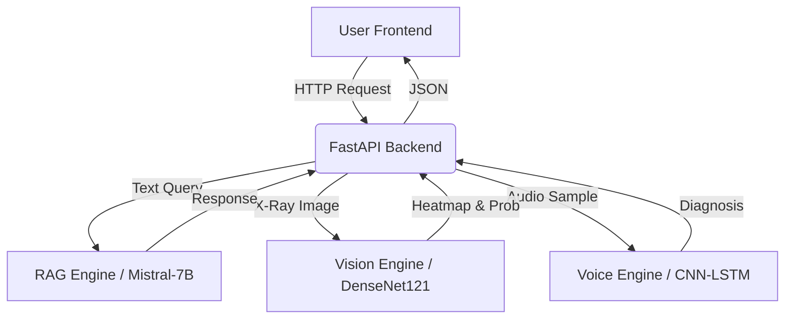

# 🩺 MedStral: Intelligent Multimodal Medical Assistant

**MedStral** is a unified AI diagnostic platform that bridges the gap between text, vision, and audio in healthcare. It combines a fine-tuned **Large Language Model (LLM)** for reasoning, **Computer Vision** for X-ray analysis, and **Audiomics** for respiratory biomarker detection into a single, secure web application.

-----

## 🚀 Key Features

### 🧠 1. The Generative Core (Chat)

  * **Zero-Hallucination RAG:** Anchors all answers in verified medical literature using **Pinecone** vector search.
  * **Fine-Tuned Mistral-7B:** Specialized model trained on **300k+ medical interactions** to understand clinical nuance and safety protocols.
  * **Multi-Language:** Real-time translation support for English, French, and Arabic.

### 🩻 2. The Visual Cortex (X-Ray)

  * **DenseNet121 Architecture:** Detects **14 thoracic pathologies** (e.g., Edema, Cardiomegaly) with radiologist-level sensitivity.
  * **Explainable AI (XAI):** Generates **Grad-CAM heatmaps** to show exactly *where* the model is looking, building clinical trust.

### 🎙️ 3. The Auditory Cortex (Voice)

  * **Respiratory Diagnostics:** Analyzes **Cough**, **Breath**, and **Speech** samples using a **CNN-LSTM** ensemble.
  * **Biomarker Detection:** Screen for respiratory infections (COVID-19, Bronchitis) via non-invasive audio analysis.

-----

## 🛠️ Technology Stack

| Component | Technology |
| :--- | :--- |
| **Backend** | FastAPI (Python), Uvicorn |
| **LLM Engine** | PyTorch, Unsloth, PEFT (LoRA), LangChain |
| **Computer Vision** | Torchvision, OpenCV (Grad-CAM) |
| **Audio Processing** | Librosa (Spectrograms), XGBoost |
| **Vector DB** | Pinecone (Serverless) |
| **Database** | SQLite + SQLAlchemy (User Sessions) |
| **Frontend** | HTML5, CSS3, Vanilla JS (Micro-Frontend Architecture) |

-----

## 🏗️ Architecture

MedStral follows a **Hub-and-Spoke** architecture where the FastAPI backend orchestrates data flow to specialized inference engines.



-----

## ⚡ Installation & Setup

### Prerequisites

  * Python 3.10+
  * NVIDIA GPU (Recommended for LLM inference, min 12GB VRAM)
  * [Pinecone Account](https://www.pinecone.io/) (Free tier works)

### 1\. Clone the Repository

```bash
git clone https://github.com/yourusername/medstral.git
cd medstral
```

### 2\. Install Dependencies

```bash
pip install -r requirements.txt
```

### 3\. Environment Variables

Create a `.env` file in the root directory:

```env
# Security
SECRET_KEY=your_secret_jwt_key_here
ALGORITHM=HS256

# Pinecone Vector DB
PINECONE_API_KEY=your_pinecone_key
PINECONE_ENV=gcp-starter

# Optional: HuggingFace Token (if using gated models)
HF_TOKEN=your_hf_token
```

### 4\. Download Model Weights

Place your trained models in the root folder:

  * `chexpert_model_2gpu.pth` (X-Ray Model)
  * Ensure Mistral adapter paths are correctly set in `model_service.py`.

### 5\. Run the Application

```bash
uvicorn main:app --reload
```

Access the app at `http://localhost:8000`.

-----

## 📊 Model Performance

| Modality | Metric | Score | Note |
| :--- | :--- | :--- | :--- |
| **Vision** | AUROC (Edema) | **0.9456** | State-of-the-Art on CheXpert |
| **Vision** | AUROC (Effusion) | **0.9313** | High sensitivity for fluid detection |
| **Text** | Hallucination Rate | **\< 5%** | Reduced via RAG grounding |
| **Voice** | Accuracy | **\~88%** | Binary classification (Sick vs Healthy) |

-----

## 📂 Project Structure

```text
/medstral
├── main.py                 # Application Entry Point
├── auth.py                 # JWT Authentication
├── database.py             # SQLite Setup
├── requirements.txt        # Python Dependencies
│
├── /services               # AI Inference Logic
│   ├── model_service.py    # LLM (Mistral)
│   ├── vision_service.py   # X-Ray (DenseNet)
│   └── voice_service.py    # Audio (Signal Processing)
│
├── /templates              # Frontend HTML Pages
│   ├── index.html          # Chat
│   ├── vision.html         # Vision
│   └── voice.html          # Voice
│
└── /static                 # CSS & JS Assets
```

-----

## 🛡️ Disclaimer

> **Critical Warning:** MedStral is a research prototype intended for **educational and assistive purposes only**. It utilizes artificial intelligence to analyze data patterns but does **not** replace professional medical diagnosis, advice, or treatment by a qualified healthcare provider.

-----

## 🤝 Contributing

1.  Fork the Project
2.  Create your Feature Branch (`git checkout -b feature/AmazingFeature`)
3.  Commit your Changes (`git commit -m 'Add some AmazingFeature'`)
4.  Push to the Branch (`git push origin feature/AmazingFeature`)
5.  Open a Pull Request

-----

## 📄 License

Distributed under the Apache 2.0 License. See `LICENSE` for more information.
